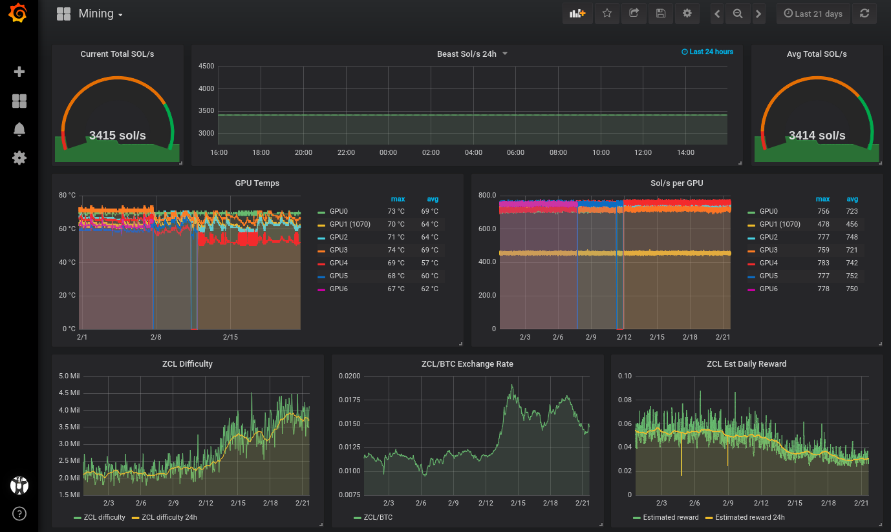

# cryptograf

To build the project you can use Docker. Clone this repo, edit the various settings to point to your database, etc and then run:

    docker build -t cryptograf .

To run the app every minute as a Docker I put the following in my `/etc/crontab` on Linux...

    * * * * * /usr/bin/docker run --rm cryptograf

## Grafana

I've included an example dashboard as a JSON file for easy imports.

I also wrote on my site an extensive Grafana, InfluxDB introduction at Linuxserver.io, [here](https://www.linuxserver.io/2017/11/25/how-to-monitor-your-server-using-grafana-influxdb-and-telegraf/). 

